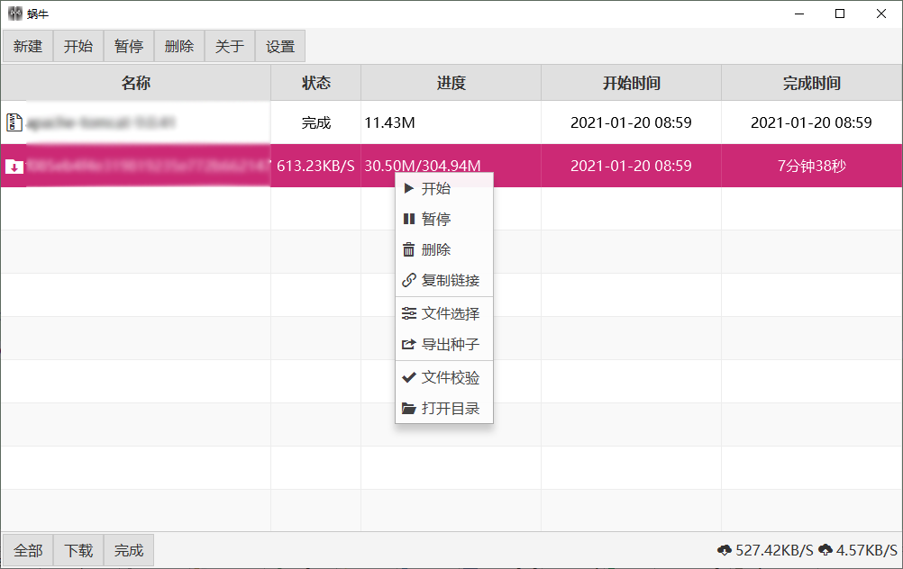

<h1 align="center">Snail（蜗牛）</h1>

<p align="center">
基于Java、JavaFX开发的下载工具，支持下载协议：BT（BitTorrent、磁力链接、种子文件）、HLS（M3U8）、FTP、HTTP。
</p>

<p align="center">
	<a target="_blank" href="https://openjdk.java.net">
		
	</a>
	<a target="_blank" href="https://openjfx.io">
		
	</a>
	<a target="_blank" href="https://github.com/acgist/snail">
		
	</a>
	<a target="_blank" href="https://gitee.com/acgist/snail">
		
	</a>
	<br />
	
	
	
	
	
</p>

----

## 结构

|项目|描述|
|:--|:--|
|snail|下载核心|
|snail-javafx|电脑界面|

> 电脑界面只是方便操作，下载核心包含所有下载协议，可以完全独立使用。

## 使用

[稳定版本下载](https://gitee.com/acgist/snail/attach_files)

### 编译

```bash
mvn clean package -P release -D skipTests
```

> 推荐使用[Release](https://gitee.com/acgist/snail/releases)编译

### 界面

使用自带界面进行下载，界面使用参考[界面使用帮助](./docs/GUI.md)。

```bash
java -server -Xms128m -Xmx256m -jar snail.javafx-{version}.jar
```

### 代码

使用代码进行二次开发使用，更多参考[开发帮助](./docs/API.md)。

```xml
<dependency>
	<groupId>com.acgist</groupId>
	<artifactId>snail</artifactId>
	<version>{release.version}</version>
</dependency>
```

```java
final Snail snail = SnailBuilder.getInstance()
	.enableAllProtocol()
	.buildSync();
// BT任务需要注册文件选择事件
// GuiContext.register(new MultifileEventAdapter());
snail.download("https://www.acgist.com");
snail.lockDownload();
```

### 帮助

[开发帮助](./docs/API.md)

[使用帮助](./docs/HELP.md)

[界面使用帮助](./docs/GUI.md)

## 其他

### 仓库

GITEE：[https://gitee.com/acgist/snail](https://gitee.com/acgist/snail)

GITHUB：[https://github.com/acgist/snail](https://github.com/acgist/snail)

### 协议

[协议信息](./docs/PROTOCOL.md)

### 依赖

|项目|许可|
|:--|:--|
|[slf4j](https://www.slf4j.org)|[MIT](https://www.slf4j.org/license.html)|
|[JavaFX](https://wiki.openjdk.java.net/display/OpenJFX)|[GPLv2 + CE](https://openjdk.java.net/legal/gplv2+ce.html)|
|[OpenJDK](https://openjdk.java.net)|[GPLv2 + CE](https://openjdk.java.net/legal/gplv2+ce.html)|

### 界面



### 贡献

提交PR前请阅读[代码规范](./CODE_OF_CONDUCT.md)、[贡献规范](./CONTRIBUTING.md)

问题和建议请提交到[Issues](https://gitee.com/acgist/snail/issues)，提交前请阅读[贡献规范](./CONTRIBUTING.md)。

谢谢！

### 捐赠

[捐赠](https://www.acgist.com/sponsor)

[服务器](https://www.acgist.com/collect/server)
